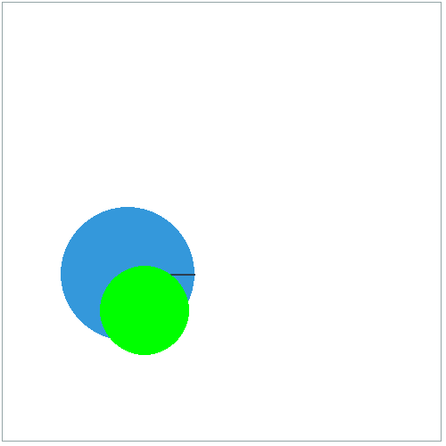

# rl_toys
A collection of toy environments and algorithm implementations.

```
pip install gym
pip install stable-baselines3
pip install pymunk
```

# Algorithm implementations

## Tabular Q learning on Grid World
grid_world_tab_Q_learning.py<br/>
<br/>

## PPO on PuckWorld
